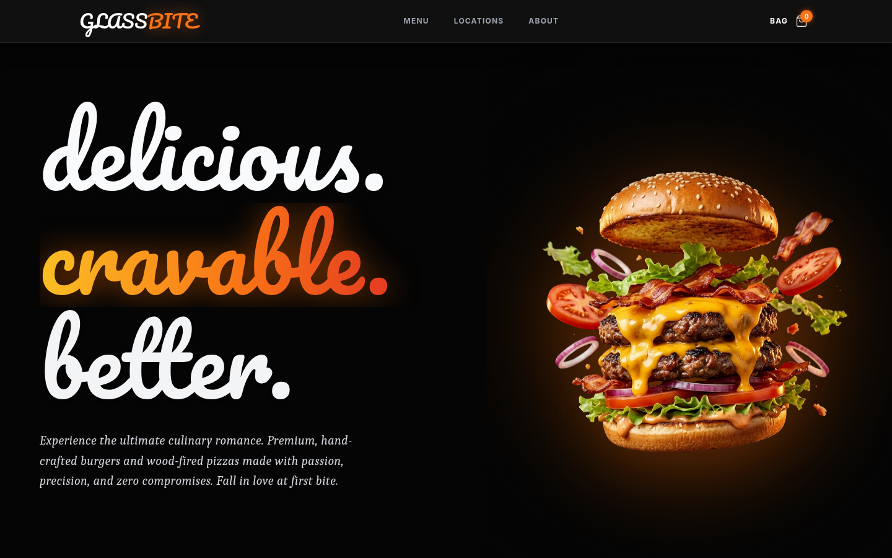
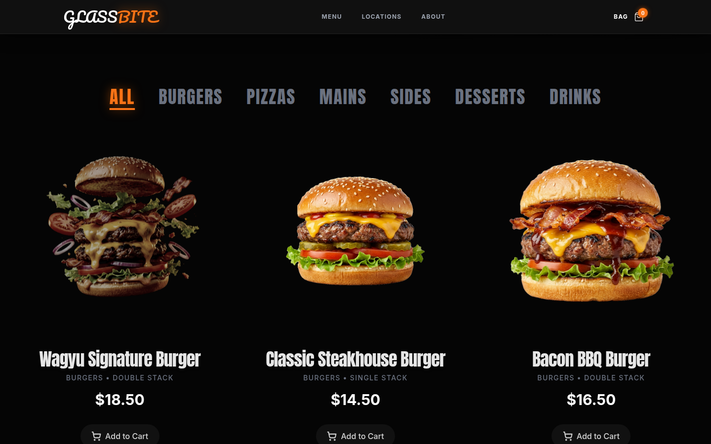
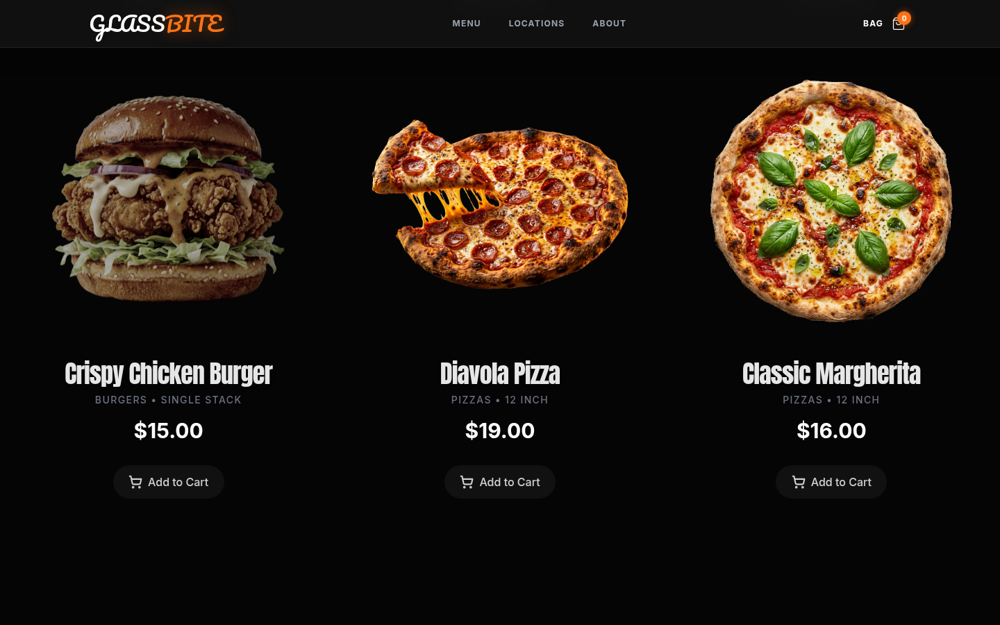
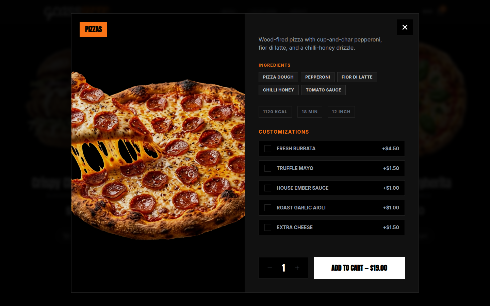
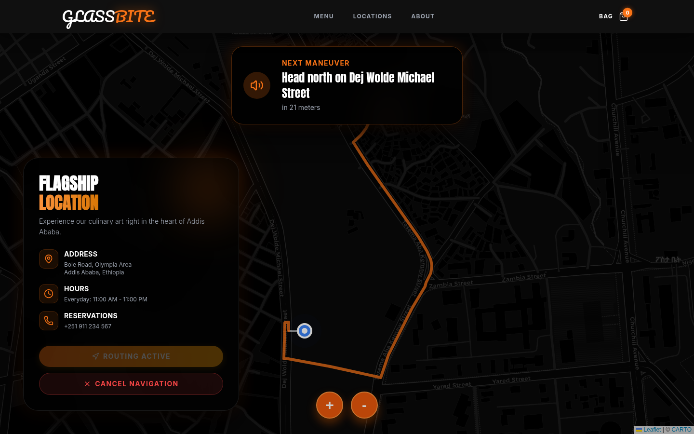
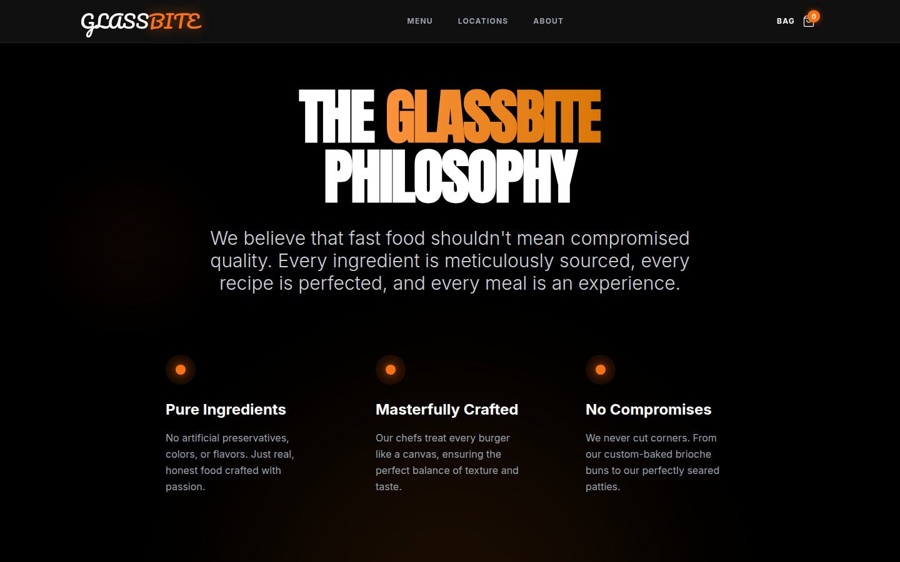

# 🍔 GlassBite

> **A cinematic, glassmorphic fast-food ordering experience.**



GlassBite is a highly-polished, visually stunning React web application designed to bring a premium, app-like feel to the fast-food ordering process. Built with a modern dark theme, it features deep, immersive colors, smooth scrolling animations, and beautiful glassmorphism UI components.

---

## ✨ Features

- **Cinematic Loading Screen**: A visually captivating animated intro that smoothly transitions into the main app.
- **Glassmorphism UI**: Beautiful, frosted-glass effects applied to navigation, modals, and cards for a sleek, modern look.
- **Smooth Animations**: Items gracefully glide into view as you scroll, both up and down, powered by Framer Motion.
- **Interactive Details**: Clicking any item reveals a stunning, blurred backdrop modal with vibrant ingredient tags and detailed descriptions.
- **Dynamic Cart Drawer**: A slide-out cart that provides a seamless checkout experience.
- **Interactive Locations**: A sleek location page integrated with custom-styled interactive maps.

---

## 📸 UI Walkthrough

### 🏠 Landing Page
A breathtaking cinematic introduction to the app.


### 📜 The Menu
Explore our delicious offerings with a grid that smoothly animates items into view as you scroll.


### 🍔 Endless Variety
Keep scrolling to reveal beautifully presented categories and items.


### 🔍 Interactive Item Details
Click on any item to view its detailed ingredients and add it to your cart. 


### 📍 Find Us & Get Directions
Check out our locations with an interactive map tailored to our dark, cinematic aesthetic. Get active routing straight to our door.


### ℹ️ About Us
Learn about our story and our commitment to quality.


---

## 🛠️ Tech Stack

- **Frontend Framework**: [React](https://react.dev/)
- **Build Tool**: [Vite](https://vitejs.dev/)
- **Styling**: Vanilla CSS with modern Glassmorphism techniques
- **Animations**: [Framer Motion](https://www.framer.com/motion/) & [GSAP](https://gsap.com/)
- **Icons**: [Lucide React](https://lucide.dev/)
- **Maps**: [React Leaflet](https://react-leaflet.js.org/)

---

## 🚀 Quick Start

To run GlassBite locally on your machine:

1. **Clone the repository** (if applicable):
   ```bash
   git clone https://github.com/yourusername/glassbite.git
   cd glassbite
   ```

2. **Install dependencies**:
   ```bash
   npm install
   ```

3. **Start the development server**:
   ```bash
   npm run dev
   ```

4. **Open in browser**:
   Navigate to `http://localhost:5173` to see the app in action!

---

## 📦 Deployment

GlassBite is fully optimized for production out of the box. 

To build the project for deployment:
```bash
npm run build
```
The optimized static files will be generated in the `dist/` directory, ready to be deployed to platforms like Vercel, Netlify, or Firebase Hosting.

---

*Crafted with passion for a premium dining UI experience.*
